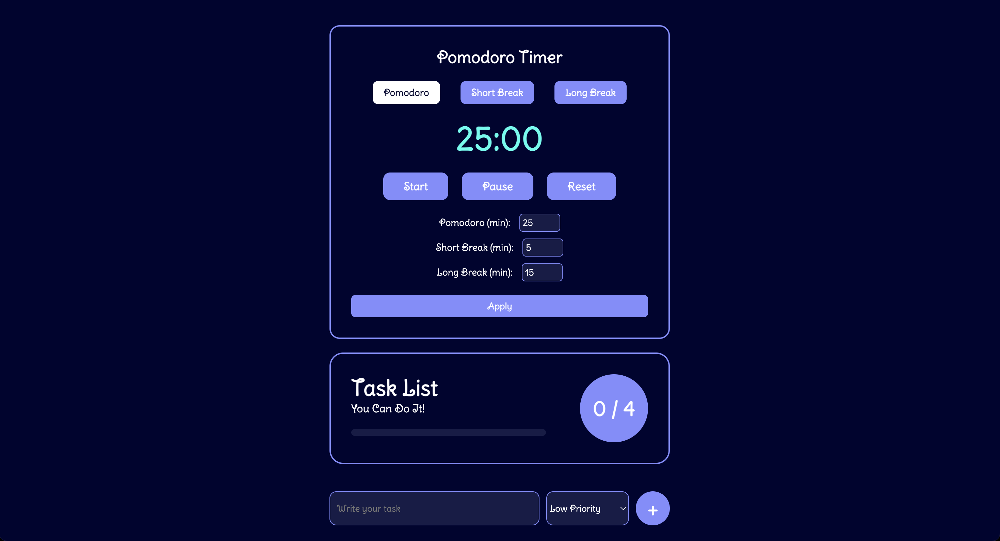
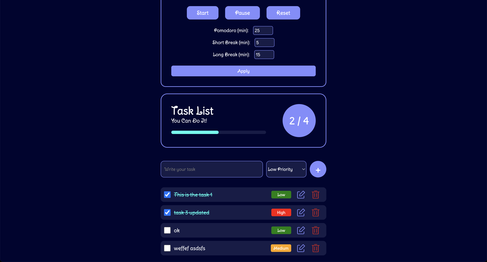

# 📝 Advanced Todo App 👉 [Live Here](https://todo-js-ashy.vercel.app/)

An elegant, interactive and feature-rich Todo List application built with vanilla JavaScript, HTML, and CSS — featuring task editing, status tracking, local storage, toast notifications, and a celebratory confetti animation when all tasks are complete. 🎉

---

## 🚀 Features

- ✅ Add, edit, delete, and complete tasks
- 🎯 Prioritize tasks as High, Medium, or Low
- 🎨 Priority-based visual indicators and badges
- 🔀 Tasks auto-sort by priority level
- 🧠 Editable Pomodoro timer with Short and Long breaks
- 🛠️ Custom timer input fields with minimum limit validation
- ⏱️ Countdown timer with live display and mode switching
- 🧮 Visual progress bar & dynamic task counter
- 🔔 Toast notifications with action feedback
- 🎉 Confetti celebration on task completion
- 📦 Persistent storage via `localStorage`
- 💅 Stylish and responsive UI with CSS variables

---

## 🛠️ Tech Stack

- HTML5
- CSS3 (with custom properties and transitions)
- JavaScript (DOM, events, localStorage)

---

## 📸 Preview

---

## 🧩 Bonus Features

- 🔄 Reset completed tasks when all are done
- 🚫 Prevent false celebration when deleting last task
- 📏 Modular layout with responsive two-column Pomodoro design
