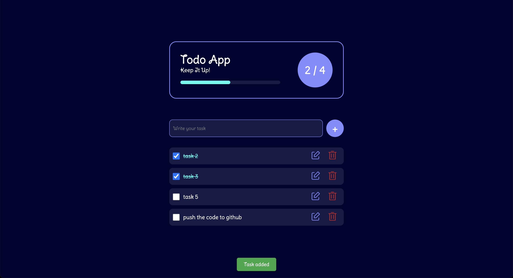

# 📝 Advanced Todo App 👉 [Live Here](https://todo-js-ashy.vercel.app/)

An elegant, interactive and feature-rich Todo List application built with vanilla JavaScript, HTML, and CSS — featuring task editing, status tracking, local storage, toast notifications, and a celebratory confetti animation when all tasks are complete. 🎉

---

## 🚀 Features

- ✅ Add, edit, delete, and complete tasks
- 📦 Persistent storage via `localStorage`
- ✨ Visual progress bar & dynamic task counter
- 🖍️ Edit-in-place with smart update logic
- 🎊 Confetti effect when all tasks are completed
- 🔔 Toast notifications for task actions
- 💅 Stylish UI with CSS variables and smooth transitions

---

## 🛠️ Tech Stack

- HTML5
- CSS3 (with custom properties and transitions)
- JavaScript (DOM, events, localStorage)

---

## 📸 Preview

---
